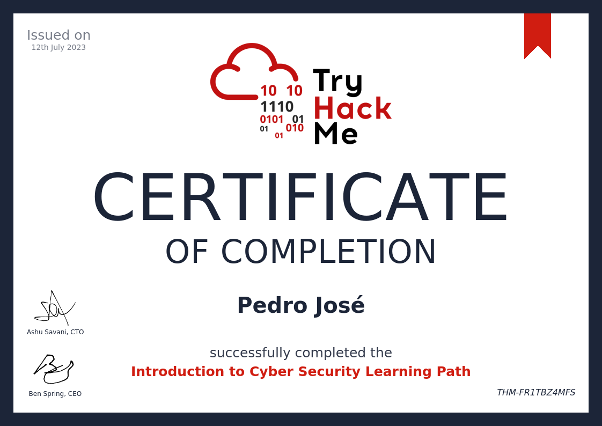
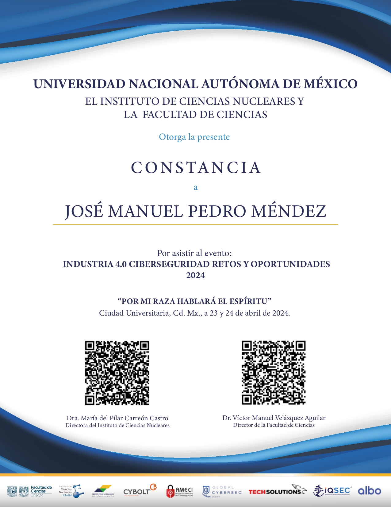
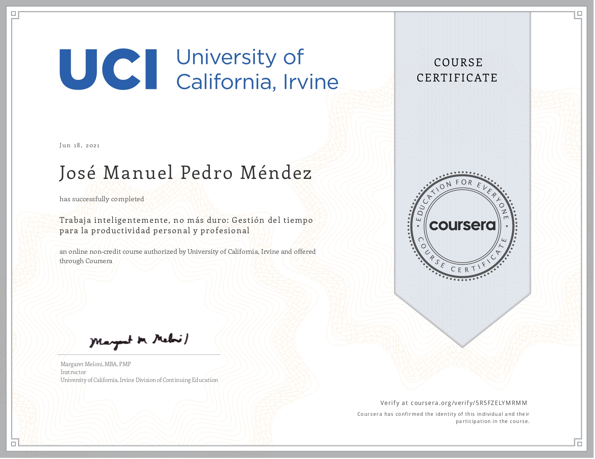

# Some Certificates

In this repository you will find some certificates that support my abilities/skills.

## Overview

* **Structure-Topics**:	
	
	- Cybersecurity
		- [Introduction to Cyber Security](#introduction-to-cyber-security-by-tryhackme)
			- Basics of Cyber Security.
		- [Event: Industry 4.0: Cybersecurity: Risks and oportunities.](#industria-40-ciberseguridad-retos-y-oportunidades)
	
	- Several Different Topics:
		- [Work Smarter, not harder(not only)](#work-smarter-not-only-harder-by-university-of-california-irvine--coursera) by University of California, Irvine.
			- Time management for personal and professional productivity

	- [Python: I learn from the best!!! I'm talking about Chuck](#python)
		- [Introduction to Programming in Python](#introduction-to-programming-in-python-by-pontifica-universidad-católica-de-chile)
			- Learn to program using Python.
		- [Using Databases with Python](#using-databases-with-python-by-university-of-michigan--coursera)
			- Work with databases using Python.
		- [Using Python to Access Web Data](#using-python-to-access-web-data-by-university-of-michigan--coursera)
			- Access and process web data using Python.
		- [Capstone Python: Retrieving, Processing and Visualizing Data with Python](#capstone-python-by-university-of-michigan--coursera)
			- Final project for the Python specialization.

	- [Artificial Intelligence: Sesenta anios de inteligencia artificial](#sesenta-anios-de-inteligencia-artificial-by-unam--coursera)
		- History and development of AI.

## Cybersecurity

### Introduction to Cyber Security by TryHackMe

|  |
|:----------------------------------:|
| Certificate of Introduction to Cyber Security by THM |

### Industria 4.0: Ciberseguridad retos y oportunidades

|  |
|:----------------------------------:|
| Attendance Certificate |

## Work Smarter, not only harder by University of California, Irvine | Coursera.

### Time management for personal and professional productivity

|  |
|:---------------------------:|
| Certificate of Work Smarter, not harder: Time Management for personal and professional productivity by UCI on Coursera |

## Python

### Introduction to Programming in Python by Pontifica Universidad Católica de Chile | Coursera.

|  |
|:----------------------------------:|
| Certificate of Introduction to Programming in Python by PUCC|

### Capstone Python by University of Michigan | Coursera.

|  |
|:----------------------------------:|
| Certificate of Capstone Python by University of Michigan |

### Using Databases with Python by University of Michigan | Coursera.

|  |
|:----------------------------------:|
| Certificate of Using Databases with Python by University of Michigan |

### Using Python to Access Web Data by University of Michigan | Coursera.

|  |
|:----------------------------------:|
| Certificate of Using Python to Access Web Data by University of Michigan |

## Artificial Intelligence

### Sesenta anios de inteligencia artificial by UNAM | Coursera.

|  |
|:----------------------------------:|
| Certificate of Sesenta anios de inteligencia artificial |